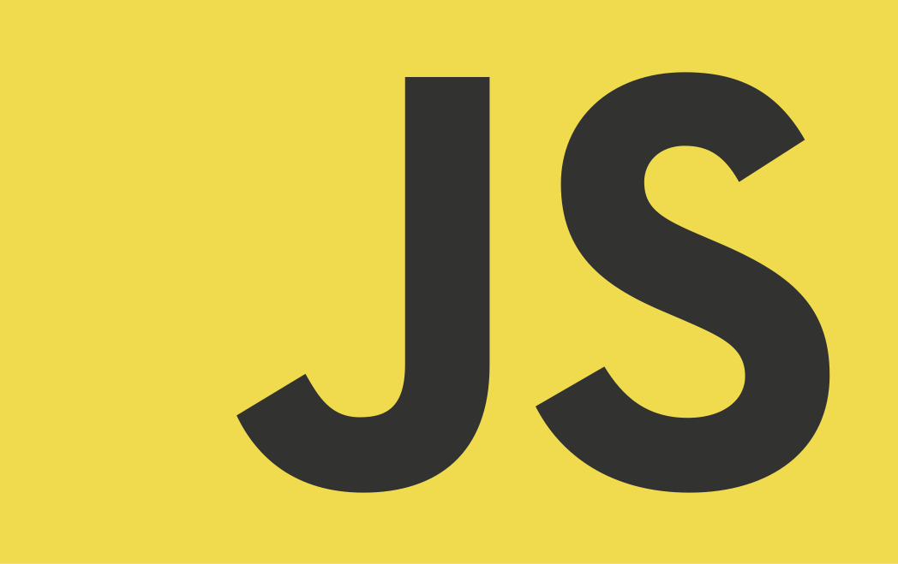

# zTone

*Recipes for cooking JavaScript*

There are many perfect guides and tutorials how to write clear and well understandable code. Also our world has such outstanding tools to control clearness of JavaScript code as JSLint. Instead of reinventing the wheel I want to formulate some common principles and approaches, some unobvious improvements for writing clear, well readable, self-explained, efficient JavaScript code, certainly, from my point of view. The ideas expressed here can use for creating own detailed style guides and conventions inside developer teams. So...


### Identifiers

- Use well known acronyms and shorthands to make naming of auxiliary identifiers in your code (e.g. function parameters, counters etc.) more consistent and self-explained. I've collected a list (look at it below) of the most common and frequent cases which may appear in a code. They have optimal balance between brevity and intelligibility. You shouldn't go to extremes and use one-letter or even one-symbol identifiers like `_`, `$` (despite their validity) except counters in loops like `i`, `j`, `k` etc.

SHORTHAND |FULL              |
----------|------------------|
acc       |accumulator       |
cb        |callback          |
ch, char  |character         |
ctx       |context           |
el, elem  |element           |
evt`*`    |event             |
ex        |exception         |
expr      |expression        |
fn, func  |function          |
idx       |index             |
init      |initial           |
pts       |points            |
pos       |position          |
re        |regular expression|
res       |result            |
ret       |return            |
str       |string            |
txt       |text              |
xhr       |XMLHttpRequest    |
`*`**evt** because **e** or **event** are not appropriate for this purpose. **e** could mean the mathematical constant and, generally,
   is too ambiguous and overall. On the other hand, **event** isn't suitable because in event model of old IE browser creates a property of
   the global object with this name `window.event` when some event occurs. So, if you're dealing with IE you should keep this fact in mind.
- Variables which are designed to be private but not realize real privacy might be prepended with an underbar (`_`). But I think much more better is implement real private access members with closures and indicate this fact with `_` as prefix.
- Use `is`, `has`, `can`, `should`, `compute`, `init`, `get`, `find`, `count`, `num` and so on as parts (usually, prefixes) of variable/property names, depending on their meaning.
- Avoid magic numbers in code, it's the common rule. There are some rare cases which are determined by concrete context when it can be suitable, but, in general, it's considered as a bad practice.


### Loops and array iterations

Use ECMAScript 5.1 methods (`forEach`, `map`, `reduce`, `reduceRight`, `filter`, `some`, `every`) for array loops instead traditional `for`/`while`/`do...while` when it is possible. There are several reasons to do so:
- *Chaining*. You can construct chains of methods if you need, depending on result they return. Sometimes it's very useful.
- *Uniform syntax*. Every method from the list above takes in a function which is invoked on every element of an array and optional second argument which means the `this` value inside. Additionally, function/callback in each method except `reduce`/`reduceRight` takes fixed number of obvious parameters what simplifies debugging process and code understanding.
For details see [MDN: Array iteration methods](https://developer.mozilla.org/en-US/docs/Web/JavaScript/Reference/Global_Objects/Array#Iteration_methods)
- *Predefined counter*. For most cases we only want to get access to each element one-by-one. When we use these methods there is no need in additional variables, increment operations, conditions for running the loop. So we get cleaner code and avoid variable clashes or memory overhead.
- *Methods, not only loops*. It means that you can create such useful constructions as `Object.keys(obj).forEach(callback[, thisArg])`. By the way, this pattern is a good alternative to `for...in` loop with inner check for own properties.
- *New scope*. These methods incapsulate the traversing work inside themselves, so you don't pollute the external/global scope.
- *Functional style*. I mean `map`, `reduce`, `reduceRight`, `filter`, `some`, `every`. Firstly, as explained above, we don't pollute the external environment. Secondly, we use methods with function as argument what is more flexible, readable and testable.
- *Performance*. Nowadays they fast enough and have a comparable speed as traditional loops (e.g. [jsPerf: for vs forEach](https://jsperf.com/for-vs-foreach/37)).


### Equality operators

There are two equality operators in JavaScript: `==` (Abstract Equality Comparison/equality/type–converting comparison/"double equals") and `===` (Strict Equality Comparison/identity/strict equality/"triple equals"). There is also `Object.is` (new in ECMAScript 2015), but I'd like to focus on the first two. I recommend always use `===` (Strict Equality Comparison) for all your and your team code instead of `==` unless you really want this behavior. Sometimes speak about the following case as an exception from this rule. Assume we want to do something if and only if our variable `k` stores something besides `null` and `undefined`. Using `==` (whose complement is `!=`) we can write verification in short 
`k != null`. Otherwise we should write `k !== null && k !== undefined`, for example.

In addition, using `==` rather than `===` is less performant in general, because as described in original algorithm in ECMAScript specification, there is fallback to `===` algorithm from `==` one if types become the same. And the most time of working `==` algorithm tries to convert types to the same values (if they were different), then starts from the beginning. So, potentially, "non-strict" algorithm can make several cicles through its steps before invoke `===` comparison.

Also there is a risk of undesired behavior if `valueOf` was redefined to something that can break our code, for example:

```javascript
Object.prototype.valueOf = () => {
	while(1);
};
```

Additionally, the built-in numeric coercion on arrays (abstract operation `ToPrimitive`) will fail with a stack overflow error if your array is deeply nested enough. (See [JavaScript in Ten Minutes](https://github.com/spencertipping/js-in-ten-minutes))

Thus, for better readability, for avoiding unexpected behavior and mistakes, security holes and loss to performance, use `===` (Strict Equality Comparison).


### Performance

Performance should be one of the most important basic principles. Software becomes more complex, technical requirements grow, user interfaces can contain various complex logic, but application of Moore's law in the future is questionable. In truth, all users probably will be happy to deal with more fast web apps and web interfaces in general. So:
- Cache your data, reuse computation results which you've already obtained. It's significantly more imporant with APIs such DOM.

###### What can be cached?
- `length` property of array/collection being iterated
- selected DOM elements, especially when calling highly nested DOM objects

```javascript
let divs = document.getElementsByTagName('div');
```

- the generated markup or DOM elements before inserting in DOM tree
- object methods (but remember about function aliasing, which is assigning a method to a variable, to avoid losing `this`)

```javascript
let fetch = document.getElementById.bind(document);
```

- template’s raw text and/or pre-compiled version of the template (if you’re using HTML templates)


### Comments and documentation

- Tricky code should not be commented but rewritten! (“Code Complete”, Steven C. McConnell — Microsoft Press)
- Use JSDoc syntax for consistency of comments.


### Performance cookbook


### Miscellaneous

- Imagine you have a function with the following signature:

```javascript
function func(param_0, param_1, param_2) {}
```

If for some reason you don't pass one or more arguments (don't fill one or more parameters) on invocation of corresponding 
function, I recommend to pass entity which means **nothing** in JavaScript instead. And this entity is `null`. So when you don't 
want to pass the enough number of arguments, it's better to invoke `func` as, for example:

```javascript
func(value, null, null);
```

It's a good choice especially when there are many lines of code between function declaration and invocation (or even they are used 
in different files/modules), because you have a simple reminder of actual function behaviour and this approach helps to obtain 
self-documented code. From my point of view, this is some kind of discipline for coding style.

- Avoid interfering with a user's code where possible. For example, in _memoization_ pattern there are possibilities to use 
cache outside of the returned function or add custom properties directly to the function to be memoized. First approach is better.
Also adding memoization functionality to `Function.prototype` seems a god idea.


## Various style guides and code conventions

- [Airbnb JavaScript Style Guide](https://github.com/airbnb/javascript#airbnb-javascript-style-guide-)
- [Idiomatic.js](https://github.com/rwaldron/idiomatic.js#principles-of-writing-consistent-idiomatic-javascript)
- [jQuery JavaScript Style Guide](https://contribute.jquery.org/style-guide/js/)
- [Google JavaScript Style Guide](https://google.github.io/styleguide/javascriptguide.xml)
- [Crockfords’s Coding Standards for JavaScript](http://javascript.crockford.com/code.html)
- [Node.js Style Guide](https://github.com/felixge/node-style-guide#nodejs-style-guide)
- [WordPress JavaScript Coding Standards](https://make.wordpress.org/core/handbook/best-practices/coding-standards/javascript/)
- [npm-coding-style](https://docs.npmjs.com/misc/coding-style)
- [jscs JavaScript Code Style](https://github.com/DarkPark/jscs)


## Versions
Actual version of zTone is 0.1.0-alpha.